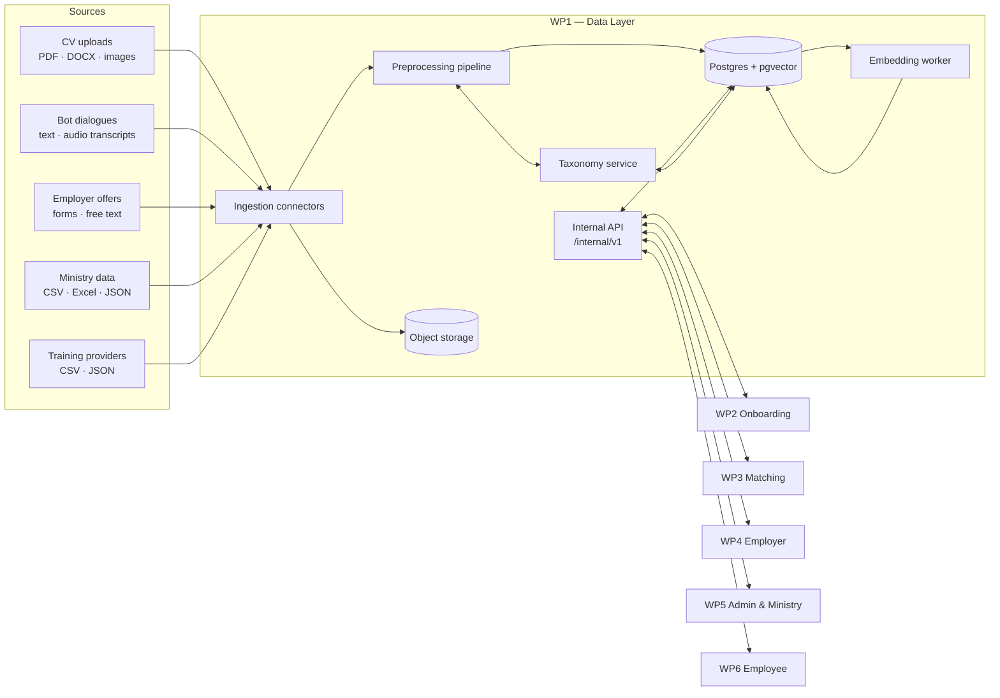
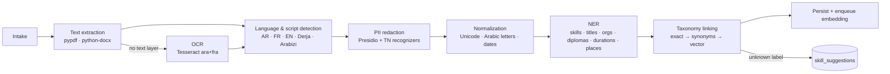
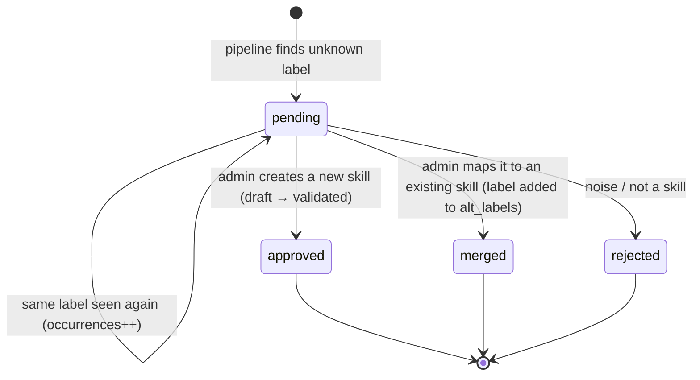
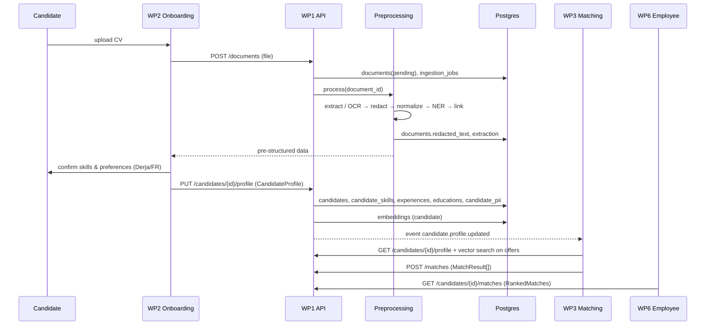

# WP1 — Data Layer & Preprocessing · Detailed Architecture

| | |
|---|---|
| **Version** | 0.1 (S1 — schema & contracts) |
| **Scope** | Collection, preprocessing, skills ontology, shared database, internal APIs |
| **Requirements** | [PRD.md](PRD.md) |
| **Short version** | [ARCHITECTURE_SUMMARY.md](ARCHITECTURE_SUMMARY.md) |
| **Tables & fields** | [DATA_MODEL.md](DATA_MODEL.md) |

---

## 1. Purpose

WP1 is the data foundation the other five modules sit on. It has four building blocks, matching the WP1 specification:

1. **Multi-source collection**: CVs, bot dialogues, employer offers, ministry data, training catalogs.
2. **Preprocessing pipeline**: parsing, OCR, PII redaction, normalization, NER.
3. **Skills taxonomy & ontology**: one reference for hard, soft and language skills, aligned with the Tunisian market.
4. **Shared database**: one entity schema, used by the 5 modules through internal REST/gRPC APIs.

## 2. Architectural principles

| # | Principle | Consequence |
|---|---|---|
| P1 | **Single source of truth** | One Postgres database. Modules do not keep their own copies of candidates, offers or skills. |
| P2 | **Contract first** | Every inter-module payload is a versioned Pydantic model exported to JSON Schema. The code follows the contract. |
| P3 | **Privacy by design** | PII is redacted at intake and stored in one isolated table. Matching never sees identity data. |
| P4 | **Everything maps to the taxonomy** | Skills and occupations are referenced by code. Free text is kept for traceability but is never the join key. |
| P5 | **Traceable and replayable** | Raw inputs are kept. Every derived row records the pipeline or model version that produced it. |
| P6 | **Sovereign and local** | Self-hosted Postgres, storage and models. No raw personal data goes to third-party APIs. |
| P7 | **Simple first** | Postgres + pgvector instead of a separate vector database, REST before gRPC, batch before streaming. |

## 3. System context



## 4. Components

### 4.1 Ingestion connectors

| Connector | Trigger | Input | Writes |
|---|---|---|---|
| `cv_upload` | HTTP multipart from WP2/WP6 | PDF, DOCX, JPG, PNG ≤ 10 MB | Object storage + `documents` + `ingestion_jobs` |
| `conversation` | Webhook from WP2 at the end of a session | Transcript JSON, optional audio | `conversation_sessions`, `documents` (audio) |
| `employer_offer` | HTTP from WP4 | `NormalizedJobOffer` | `job_offers`, `job_offer_skills` |
| `ministry_market` | Upload from WP5 or scheduled pull | CSV, Excel, JSON | `market_datasets`, `market_indicators` |
| `training_catalog` | Upload or feed | CSV, JSON | `training_providers`, `training_courses`, `training_course_skills` |

Common rules:
- Each run creates an `ingestion_jobs` row with `pipeline_version`, counters and a per-record `errors` list.
- Uploads are deduplicated by `documents.sha256`.
- Processing is idempotent: running the same input again produces the same rows, keyed by natural keys and hashes.
- Batch sources process record by record; a bad row is reported and does not abort the batch.

### 4.2 Preprocessing pipeline



| Stage | Detail | Output |
|---|---|---|
| Text extraction | `pypdf` (already used by WP3) for PDFs, `python-docx` for DOCX | Raw text + layout blocks |
| OCR | Tesseract with `ara+fra` models; OpenCV deskew and binarization for phone photos | Text + per-block confidence |
| Language/script | fastText LID plus a Derja/Arabizi heuristic (digits 2/3/5/7/9 inside Latin words, Derja lexicon) | `lang`, `script` per segment |
| PII redaction | Microsoft Presidio with custom recognizers: `+216` / 8-digit phones, emails, 8-digit ID-like numbers, person names (FR/AR), addresses | Redacted text; entities moved to `candidate_pii` |
| Normalization | NFC; Arabic: remove tatweel and diacritics, unify alef forms (أ إ آ → ا), ى → ي, ة → ه for matching keys only; date/duration parsing ("5 ans", "خمسة سنين") | Normalized text + canonical dates/durations |
| NER | Rules + gazetteers from the taxonomy, then a multilingual token-classification model (or WP2's local LLM in structured-output mode) | Entities with character spans |
| Taxonomy linking | 1) exact match on normalized label, 2) `alt_labels` synonyms, 3) cosine search on skill embeddings (threshold ≈ 0.80). Below threshold → `skill_suggestions` | `skill_code` + confidence |
| Persistence | Writes typed rows, stores the NER output in `documents.extraction`, then enqueues the entity for embedding | Rows + embedding job |

PII rule: **redaction happens before anything is persisted for reuse or sent to a model.** `documents.redacted_text`, `candidate_skills.evidence`, `conversation_sessions.transcript` and every embedding are computed from redacted text only.

### 4.3 Taxonomy service

- **Model:** `skill_categories` (tree), `skills` (FR/AR/Derja labels, `alt_labels`, type, status, version, optional ESCO URI), `skill_relations` (broader/related/equivalent), `occupations` (national code + ISCO-08), `occupation_skills`.
- **Codes:** skills `SK-####`, occupations `OC-####` (the ISCO-08 unit group where one exists), sectors `SEC-*`. A code never changes meaning. When a concept changes, the old skill is deprecated and a new one is created.
- **Governance lifecycle:**



- **Seeding (W2):** start from ESCO and ISCO-08 for structure, add Tunisian-specific skills and occupations from ministry nomenclatures and job-board samples, then translate to AR and add Derja synonyms from WP2 transcripts.

### 4.4 Shared database

- **Engine:** Supabase Postgres (the team already uses Supabase in WP4) with the `vector` extension.
- **Schema:** 35 tables in 9 domains. See [DATA_MODEL.md](DATA_MODEL.md).
- **Migrations:** plain SQL in `supabase/migrations/`, applied with `supabase db push`. The ORM in `mahara_data.db.models` mirrors it and a pglast-based test checks that they stay identical.
- **Object storage:** Supabase Storage buckets `cv-raw`, `audio-raw`, `datasets`, `certificates`. They are private and accessed through signed URLs. `documents.storage_path` holds `<bucket>/<key>`.

### 4.5 Embedding worker

- One table, `embeddings(entity_type, entity_id, model_name, embedding vector(768), content_hash)`, unique per (entity, model).
- Entity kinds: candidate, job_offer, skill, occupation, training_course.
- Re-embedding happens only when the `content_hash` of the source text changes. Several models can coexist during a migration, and WP3 filters on `model_name`.
- Index: HNSW with `vector_cosine_ops`.
- Proposed model: a 768-dimension multilingual sentence-transformer (see PRD §12). The dimension is fixed in `mahara_data.reference.EMBEDDING_DIM`.
- Embeddings are computed from **redacted** text only.

### 4.6 Internal API

- FastAPI service `data-api` under the prefix `/internal/v1`. Only other module backends call it; it is never exposed to browsers.
- Service-to-service auth: one JWT per module (`sub = wp3-matching`, and so on) with scopes. User-level RBAC is enforced from the forwarded user role.
- Request and response bodies are the Pydantic contracts in `mahara_data.schemas`. OpenAPI is generated.
- Errors use the `ApiError` shape. Lists use `Page[T]`.
- gRPC is optional, for WP3 bulk reads, once REST latency is measured (PRD FR-API-06).

## 5. End-to-end data flows

### 5.1 CV onboarding (WP2 → WP1 → WP3 → WP6)



### 5.2 Voice onboarding for non-literate candidates

WP2 runs the 5 guided audio questions → speech-to-text → `POST /conversations` with the transcript. WP1 redacts it, classifies intents and builds the `AppetenceVector`. WP2 then sends a `CandidateProfile` with `onboarding_path = derja_guided_voice` and `conversation_session_id` set. Skills come in with `source = dialogue` and a confidence score, and experiences usually carry `duration_months` and `is_informal = true` instead of dates.

### 5.3 Offer publication and feedback loop (WP4 ↔ WP1 ↔ WP3 → WP5)

1. WP4 sends `POST /offers` with a `NormalizedJobOffer` (drafted with WP2's writing assistant, checked by the non-discrimination guardrail; flags go to `guardrail_flags`).
2. WP1 validates skill codes, stores the offer and its skills, and embeds the offer.
3. WP3 scores candidates and posts `MatchResult` rows. WP4 reads `GET /offers/{id}/candidates`, which returns the ranked list **without PII**.
4. A candidate applies from WP6 (`POST /applications`). The current `match_result_id` is snapshotted, and PII becomes visible to that employer for that application only (the read is audited).
5. WP4 records the decision with `POST /feedback` (`HiringFeedback`). WP3 uses it as a retraining signal and WP5 as an impact metric.

### 5.4 Ministry market data (WP5 → WP1 → WP5/WP3)

`POST /market/datasets` (metadata + file) → an ingestion job parses each row → nomenclatures are aligned (ministry codes → `OC-`, `SEC-`, `TN-xx`) → `market_indicators`. Unmapped rows go to `ingestion_jobs.errors`. `GET /analytics/skill-gaps` combines offer demand (`job_offer_skills` on published offers) with candidate supply (`candidate_skills`) per governorate → `SkillGapAggregate` for the ministry dashboard.

### 5.5 Training and certifications (Providers → WP1 → WP6/WP3)

Catalogs come in as `TrainingCourseRecord` (each course linked to skills and target levels). WP3 uses `training_course_skills` to fill roadmap steps. Certifications (`CertificationRecord`) start as `pending`. Once verified, they add or raise `candidate_skills` with `source = certification`.

## 6. Data model overview

| Domain | Tables | Main writer | Main readers |
|---|---|---|---|
| Reference | `governorates`, `sectors` | WP1 (seed) | All |
| Accounts | `users` | WP1 / auth | All |
| Taxonomy | `skill_categories`, `skills`, `skill_relations`, `skill_suggestions`, `occupations`, `occupation_skills` | WP1, WP5 (validation) | All |
| Candidates | `candidates`, `candidate_pii`, `candidate_skills`, `candidate_experiences`, `candidate_educations`, `candidate_desired_occupations`, `conversation_sessions` | WP2 via WP1 | WP3, WP4, WP6 |
| Employers & offers | `employers`, `job_offers`, `job_offer_skills`, `applications`, `hiring_feedback` | WP4, WP6 | WP3, WP5 |
| Matching | `match_results`, `skill_gaps`, `roadmaps`, `roadmap_items` | WP3 | WP4, WP6, WP5 |
| Training | `training_providers`, `training_courses`, `training_course_skills`, `candidate_certifications` | Providers, WP1 | WP3, WP6, WP5 |
| Market | `market_datasets`, `market_indicators` | WP5 via WP1 | WP5, WP3 |
| Platform | `documents`, `ingestion_jobs`, `embeddings`, `audit_logs` | WP1 | WP3 (vectors), WP5 (logs) |

Conventions: UUID primary keys (`gen_random_uuid()`), `timestamptz` everywhere, `created_at`/`updated_at` maintained by a trigger, Postgres enums storing lower-case values, `jsonb` only for lists and data that is naturally semi-structured, proficiency levels on a 1–4 scale, governorates as ISO 3166-2:TN codes.

## 7. Internal API catalog

Base path `/internal/v1`. The contract column names the model in `mahara_data.schemas` (JSON Schema in `contracts/`).

| Method & path | Contract (req → resp) | Called by |
|---|---|---|
| `POST /documents` | multipart → `{document_id, ingestion_job_id}` | WP2, WP6, WP5 |
| `GET /documents/{id}` | → status, redacted text, extraction | WP2 |
| `POST /conversations` | transcript → `AppetenceVector` | WP2 |
| `PUT /candidates/{id}/profile` · `POST /candidates` | `CandidateProfile` → `CandidateProfile` | WP2, WP6 |
| `GET /candidates/{id}/profile` | → `CandidateProfile` (no PII) | WP3, WP4, WP6 |
| `GET /candidates/{id}/identity` | → `CandidateIdentity` (audited, role-checked) | WP6 (self), WP4 (after application) |
| `DELETE /candidates/{id}` | erasure request | WP6 |
| `POST /offers` · `PUT /offers/{id}` | `NormalizedJobOffer` → `NormalizedJobOffer` | WP4 |
| `GET /offers?status=&governorate=&occupation=` | → `Page[NormalizedJobOffer]` | WP3, WP6 |
| `POST /taxonomy/resolve` | `SkillResolveRequest` → `SkillResolveResponse` | WP2, WP4 |
| `GET /taxonomy/skills` · `/occupations` | → `Page[SkillRead]` · `Page[OccupationRead]` | All |
| `GET /taxonomy/suggestions` · `PATCH /taxonomy/suggestions/{id}` | → `SkillSuggestionRead` · `SkillSuggestionReview` | WP5 |
| `POST /matches` | `MatchResult[]` → 201 | WP3 |
| `GET /candidates/{id}/matches` | → `RankedMatches` (offers) | WP6 |
| `GET /offers/{id}/candidates` | → `RankedMatches` (candidates, no PII) | WP4 |
| `PUT /candidates/{id}/roadmap` · `GET` | `Roadmap` | WP3 (write), WP6 (read) |
| `POST /applications` · `PATCH /applications/{id}` | `ApplicationCreate` / `ApplicationStatusUpdate` → `ApplicationRead` | WP6, WP4 |
| `POST /feedback` | `HiringFeedback` → 201 | WP4 |
| `POST /market/datasets` | `MarketDatasetCreate` + file → job id | WP5 |
| `GET /analytics/skill-gaps` | → `Page[SkillGapAggregate]` | WP5 |
| `POST /training/courses` · `POST /certifications` | `TrainingCourseRecord` · `CertificationRecord` | Providers, WP6 |
| `GET /ingestion/jobs` | → job status and errors | WP5 |

**Events.** For the MVP, change notifications are written to a Postgres table and read through Supabase Realtime or `LISTEN/NOTIFY`: `candidate.profile.updated`, `offer.published`, `application.created`, `feedback.created`, `taxonomy.version.published`. WP3 uses them to know what to re-score.

**Versioning.** Every contract carries `schema_version` (currently `1.0`). Adding an optional field is a minor change. Removing or renaming a field, or changing its meaning, is a major change: it gets a new path version (`/internal/v2`), and v1 stays available for one sprint.

## 8. Security and privacy

### 8.1 PII segregation

```
candidates (profile, PII-free)  ──1:1──  candidate_pii (name, email, phone, birth date, gender, address)
      ▲ read by WP3/WP4/WP6                    ▲ read by the candidate + an employer after an application (audited)
```

- The `CandidateProfile` contract has no identity fields at all. It cannot carry PII, even by mistake (`extra="forbid"`).
- Age, gender and origin never enter scoring (WP3 guardrail requirement). If WP5 needs them for fairness monitoring, it gets them only as aggregates.

### 8.2 RBAC at the data level

| Data | candidate | employer | admin | ministry | training_provider | module services |
|---|---|---|---|---|---|---|
| Own profile / PII | RW | – | R (support) | – | – | per scope |
| Other candidates' profiles | – | R ranked, no PII | R | aggregates only | – | WP3 R |
| Candidate PII | own | only for applicants to their offers | audited | – | – | – |
| Offers | R | own RW | R | R | – | WP3 R |
| Applications | own | for own offers | R | aggregates | – | – |
| Taxonomy | R | R | RW (validate) | R | R | R |
| Market data | – | – | R | RW | – | WP3 R |
| Training catalog | R | – | R | R | own RW | R |
| Audit & ingestion logs | – | – | R | – | – | – |

WP5 owns the final role matrix (their W1 deliverable). The schema already supports it through `users.role`.

### 8.3 Controls

- **RLS** is enabled on every table (deny-by-default through the Supabase REST API). Module backends connect with the service role and apply RBAC in the API layer. Per-role policies are added in W4 together with WP5.
- **Audit:** `audit_logs` records PII reads (`candidate.pii.read`), taxonomy validations, erasures and exports.
- **Encryption:** TLS in transit; Supabase at-rest encryption. Storage buckets are private and accessed through short-lived signed URLs.
- **Consent:** `candidates.consent_version` and `consent_given_at` are required before a profile is persisted.
- **Erasure:** `DELETE /candidates/{id}` sets `deleted_at`, deletes `candidate_pii` and storage objects immediately, and hard-deletes the rest through `ON DELETE CASCADE` after a grace period.
- **Retention:** raw CVs and audio are kept 12 months (to be confirmed, PRD §12); redacted text is kept while the profile exists.

## 9. Observability

| Signal | Source | Consumer |
|---|---|---|
| Ingestion volume, error rate, duration per source | `ingestion_jobs` | WP5 monitoring dashboard |
| API latency and error codes | FastAPI middleware → logs/metrics | WP5 |
| Taxonomy coverage (% linked vs suggested) | `candidate_skills` vs `skill_suggestions` | WP1, WP5 |
| Matching impact (hire rate per score band) | `hiring_feedback` ⋈ `match_results` | WP5, WP3 |
| Security events | `audit_logs` | WP5 security audit |

## 10. Technology choices

| Concern | Choice | Why |
|---|---|---|
| Database | Supabase Postgres 15+ | Already used by WP4; relational integrity; RLS; managed or self-hostable |
| Vectors | pgvector (HNSW, cosine) | Same database as the entities, so vector and SQL filters work in one query; no extra infrastructure. WP3's ChromaDB PoC can keep running locally, but the shared store is pgvector |
| ORM / contracts | SQLAlchemy 2 + Pydantic v2 | Same stack as WP4; typed; JSON Schema export |
| API | FastAPI | Same stack as WP2/WP3/WP4 |
| Parsing / OCR | pypdf, python-docx, Tesseract (`ara`, `fra`), OpenCV | Open source, works offline, supports Arabic |
| PII | Microsoft Presidio + custom TN recognizers | Pluggable recognizers, runs locally |
| NER | Taxonomy gazetteers + multilingual token classifier, or the local LLM from WP2 | Sovereign; reuses WP2's open-weights model |
| Embeddings | 768-d multilingual sentence-transformer | Handles AR/FR in one space; WP3 already depends on sentence-transformers |

## 11. Integration notes with existing branches

- **WP4 `employers` table** (`20260920000000_create_employers.sql`): the WP1 migration creates `company_size` and `employers` only if they do not already exist, then adds WP1 columns with `add column if not exists`. WP4's 8 columns are unchanged, so both migrations apply in either merge order.
- **WP4 enum mapping:** WP4's `models.py` declares `Enum(CompanySize, name="company_size")`. By default SQLAlchemy stores the member **name** (`SMALL`), but the Postgres type holds the **values** (`1-10`), so inserts fail on Postgres (SQLite tests don't catch this). The fix is `values_callable=lambda e: [m.value for m in e]`, which `mahara_data.db.base.pg_enum` already does. WP4 could also import `mahara_data.db.models.Employer` directly.
- **WP3** returns French field names (`offre_id`, `score_global`, `detail_scores`). The shared contract is `MatchResult` (`job_offer_id`, `score_global`, `breakdown`). WP3 should switch to it before W3 integration.
- **WP2** should emit `CandidateProfile`. The example payloads in `contracts/examples/` are a starting point for its JSON schema step (W1).

## 12. Deployment

| Environment | Database | Purpose |
|---|---|---|
| local | `supabase start` (Docker) or Postgres 16 + pgvector | Development; unit tests run on SQLite without Docker |
| staging | Supabase project `mahara-staging` | W4 integration testing with the 5 modules |
| prod | Supabase project (self-hosted option for sovereignty) | Pilot |

CI: `pytest` in `data-layer-wp1/` (ORM ↔ SQL ↔ enum ↔ contract sync, example payload validation, schema-export freshness), then `supabase db lint`.

## 13. Repository layout

```
supabase/migrations/
  20260921000000_wp1_shared_schema.sql   # shared schema (source of truth for SQL)
data-layer-wp1/
  docs/                  PRD, architecture, summary, data model
  mahara_data/
    enums.py             shared enums (mirrored as Postgres enum types)
    reference.py         governorates, proficiency scale, embedding dim, scoring weights
    db/                  SQLAlchemy models by domain
    schemas/             Pydantic contracts by domain
  contracts/             generated JSON Schemas + example payloads
  scripts/               export_json_schemas.py
  tests/                 sync, model and contract tests
```

## 14. Architecture decisions

| ID | Decision | Alternatives considered |
|---|---|---|
| ADR-1 | One Postgres database with pgvector | Separate vector DB (Chroma, Qdrant): one more system to run and sync, and no joins between vectors and relational filters |
| ADR-2 | PII in a separate 1:1 table | Column-level encryption only: PII would still be one `select *` away from the matching engine |
| ADR-3 | Hand-written SQL migrations + automated sync tests with the ORM | Alembic autogenerate: the team already uses Supabase migrations (WP4), and hand-written SQL is easier to review |
| ADR-4 | Postgres enums storing lower-case values | Lookup tables: heavier for fixed lists. Taxonomy-like lists that change (skills, occupations, sectors) are tables |
| ADR-5 | Proficiency on a 1–4 integer scale | Free-text levels, or CEFR only: the integer scale makes gaps computable (`required − current`) |
| ADR-6 | Polymorphic `embeddings` table | A vector column on each table: harder to run several models side by side and to re-embed |
| ADR-7 | Keep the latest `raw_profile` JSON on `candidates` | Rebuild it from tables: storing it lets the team replay and debug WP2 output. PII-free by contract |
