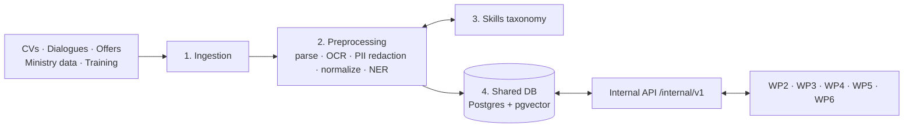

# WP1 — Data Layer · Architecture Summary

> The one-page version. Details: [ARCHITECTURE.md](ARCHITECTURE.md) · Requirements: [PRD.md](PRD.md) · Tables: [DATA_MODEL.md](DATA_MODEL.md)

## What WP1 is

The shared data foundation for the 5 application modules: **one database, one skills vocabulary, one set of JSON contracts.** WP1 has no user interface. The other modules read and write through its internal API or through the `mahara_data` Python package.



## The 4 building blocks

| Block | What it does | Key tech |
|---|---|---|
| **1. Ingestion** | Takes in 5 sources, stores raw files, tracks each run in `ingestion_jobs` | FastAPI, Supabase Storage |
| **2. Preprocessing** | Text/OCR → language detection (AR/FR/Derja/Arabizi) → **PII redaction** → normalization → NER → link to taxonomy codes | pypdf, Tesseract, Presidio |
| **3. Taxonomy** | Skills (`SK-`) and occupations (`OC-`) with FR/AR/Derja labels; unknown labels become suggestions that WP5 validates | Postgres tables + embeddings |
| **4. Shared DB + API** | 35 tables, vectors in pgvector, versioned JSON contracts | Supabase Postgres, SQLAlchemy, Pydantic |

## Who produces and consumes what

| Data | Produced by | Consumed by |
|---|---|---|
| Candidate profile (`CandidateProfile`) | WP2 | WP3, WP4, WP6 |
| Normalized offer (`NormalizedJobOffer`) | WP4 | WP3, WP6 |
| Scores, gaps, roadmaps (`MatchResult`, `Roadmap`) | WP3 | WP4, WP6, WP5 |
| Applications / hiring feedback | WP6 / WP4 | WP4 / WP3, WP5 |
| Market data (`MarketIndicatorRecord`) | WP5 (Ministry) | WP5, WP3 |
| Skills taxonomy | WP1 (+ WP5 validation) | everyone |

## Core entities

```
Reference   governorates · sectors
Taxonomy    skills · skill_relations · skill_suggestions · occupations · occupation_skills
Candidate   candidates ─1:1─ candidate_pii · candidate_skills · experiences · educations · conversation_sessions
Employer    employers → job_offers → job_offer_skills
Matching    match_results → skill_gaps · roadmaps → roadmap_items
Flow        applications → hiring_feedback
Training    training_providers → training_courses → training_course_skills · candidate_certifications
Market      market_datasets → market_indicators
Platform    documents · ingestion_jobs · embeddings · audit_logs
```

## Rules every module must follow

1. **Reference skills and occupations by code** (`SK-0101`, `OC-7112`), never by free text.
2. **Proficiency levels are 1–4** (beginner → expert). Scores are 0–100.
3. **Matching score = 50% hard skills + 20% experience + 15% soft skills + 15% location.** `score_global` must equal the weighted sum; the contract checks it.
4. **No PII in profiles.** Name, gender, age and contact details live only in `candidate_pii` and never reach WP3.
5. **Governorates use ISO codes** (`TN-11` Tunis … `TN-83` Tataouine).
6. **Contracts reject unknown fields** and carry `schema_version` (currently `1.0`).
7. **Schema changes go through a migration** in `supabase/migrations/`; CI checks that the SQL and the ORM match.

## Main internal endpoints (`/internal/v1`)

`POST /documents` · `POST /conversations` · `PUT|GET /candidates/{id}/profile` · `POST|GET /offers` · `POST /taxonomy/resolve` · `POST /matches` · `GET /candidates/{id}/matches` · `GET /offers/{id}/candidates` · `PUT|GET /candidates/{id}/roadmap` · `POST /applications` · `POST /feedback` · `POST /market/datasets` · `GET /analytics/skill-gaps`

## Key decisions

- **Postgres + pgvector** instead of a separate vector database: one system, and SQL filters and vector search in the same query.
- **PII in its own table**: removes bias inputs from matching and makes access auditable.
- **Contract-first**: the JSON Schemas in `contracts/` are the agreement between WPs.
- **Compatible with WP4**: the migration extends WP4's `employers` table without breaking it.

## One-month plan

| Week | Deliverable |
|---|---|
| **W1** | DB schema + API contracts ✅ (this branch) |
| W2 | Skills taxonomy v1 (≥ 300 skills, 100 occupations) |
| W2–3 | Ingestion connectors (5 sources) |
| W3 | Preprocessing & NER, PII redaction |
| W4 | Shared DB + internal API deployed |
| W4 | Integration tests with the 5 modules |
