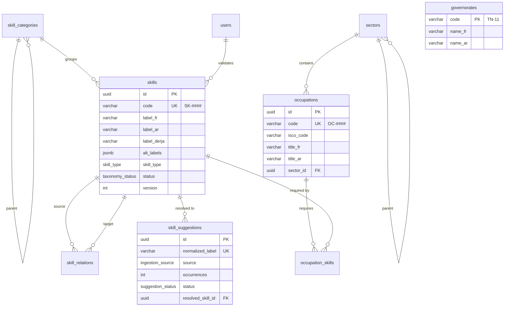
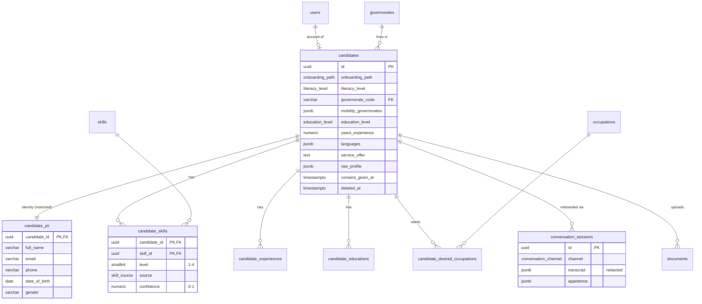
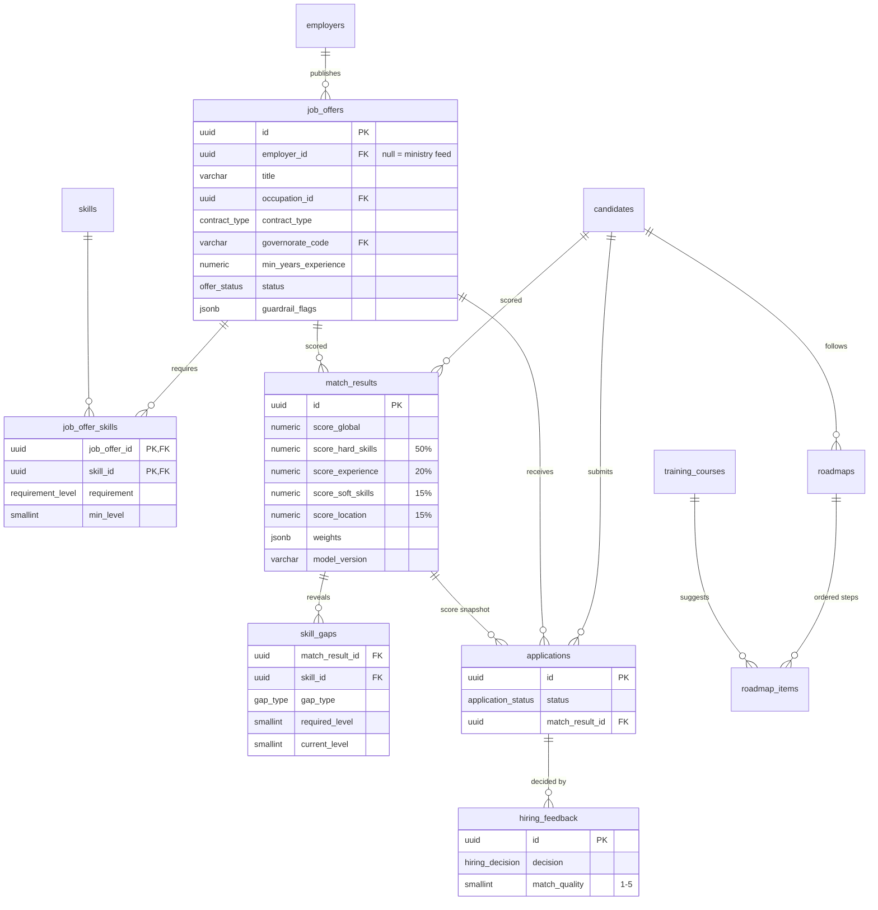
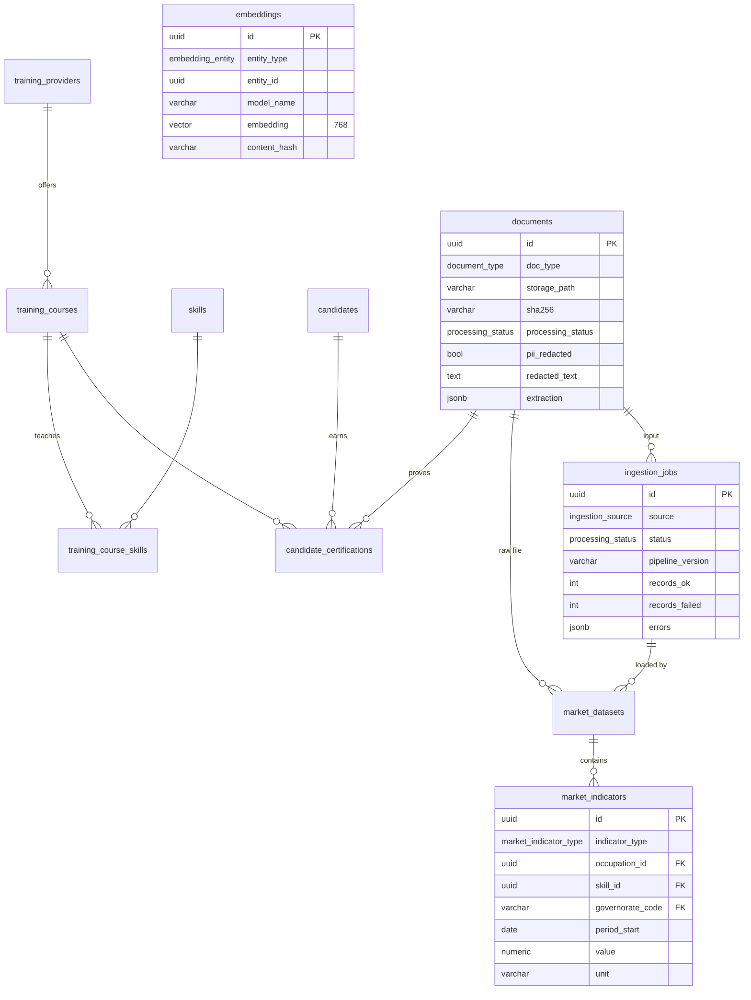

# WP1 — Data Model Reference

**Schema version 1.0.** Sources of truth:
- SQL: [`supabase/migrations/20260921000000_wp1_shared_schema.sql`](../../supabase/migrations/20260921000000_wp1_shared_schema.sql)
- ORM: [`mahara_data/db/models/`](../mahara_data/db/models/)
- JSON contracts: [`mahara_data/schemas/`](../mahara_data/schemas/), exported to [`contracts/`](../contracts/)

`tests/test_migration_sync.py` checks that the SQL and the ORM have the same tables, columns, nullability, foreign keys and enum values.

## Conventions

| Topic | Rule |
|---|---|
| Primary keys | `uuid` with `gen_random_uuid()`. Exceptions: `governorates.code` (natural key), `audit_logs.id` (bigint identity), and association tables (composite key) |
| Time | `timestamptz`. `created_at` on every entity; `updated_at` kept current by the `set_updated_at` trigger |
| Codes | Skills `SK-####`, occupations `OC-####`, sectors `SEC-*`, governorates ISO 3166-2:TN (`TN-11` … `TN-83`) |
| Levels | Proficiency is an integer from 1 to 4: 1 beginner, 2 intermediate, 3 advanced, 4 expert |
| Scores | `numeric(5,2)` between 0 and 100 |
| Money | `numeric(10,2)` in TND |
| Enums | Postgres enum types store the lower-case **values** (e.g. `cv_upload`, `1-10`) |
| JSONB | Only for lists and semi-structured data (labels, languages, transcripts, NER output). Never for anything used as a join key |
| PII | Only in `candidate_pii`, `users` (contact fields) and `employers` (business contact) |
| Deletion | Child rows cascade from `candidates`, `job_offers`, `match_results` and `roadmaps`. Candidates are first soft-deleted (`deleted_at`) |

## Entity-relationship diagrams

### Taxonomy and reference

### Candidates

### Employers, offers, applications, matching

### Training, market data, platform

## Table catalog

### Reference & accounts
| Table | Purpose | Key constraints |
|---|---|---|
| `governorates` | The 24 governorates (seeded by the migration) | PK `code` |
| `sectors` | Economic sectors (tree) | `code` unique |
| `users` | Accounts for every role; `role` drives RBAC | email or phone required; both unique |

### Taxonomy
| Table | Purpose | Key constraints |
|---|---|---|
| `skill_categories` | Skill category tree | `code` unique |
| `skills` | Skills ontology with FR/AR/Derja labels, synonyms, type, status, version | `code` unique |
| `skill_relations` | broader / related / equivalent links | PK (source, target, type); no self-reference |
| `skill_suggestions` | Unknown labels waiting for admin review | `normalized_label` unique |
| `occupations` | Occupation referential (national code + ISCO-08) | `code` unique |
| `occupation_skills` | Required/optional skills per occupation | PK (occupation, skill) |

### Candidates
| Table | Purpose | Key constraints |
|---|---|---|
| `candidates` | PII-free profile used for matching | completeness 0–100; experience ≥ 0; `user_id` unique |
| `candidate_pii` | Identity data, restricted and audited | 1:1 with `candidates`, cascade |
| `candidate_skills` | Skill, level, source and confidence per candidate | PK (candidate, skill); level 1–4; confidence 0–1 |
| `candidate_experiences` | Jobs, including informal work and durations without dates | – |
| `candidate_educations` | Diplomas and training | – |
| `candidate_desired_occupations` | Target occupations, ranked by priority | PK (candidate, occupation) |
| `conversation_sessions` | WP2 dialogues: redacted transcript, intents, interest vector | – |

### Employers, offers, applications
| Table | Purpose | Key constraints |
|---|---|---|
| `employers` | WP4 table plus WP1 columns (`user_id`, `sector_id`, `tax_id`, `governorate_code`, `website`, `description`, `updated_at`) | email unique; `tax_id` unique |
| `job_offers` | Normalized offers (employer form, ministry feed, import) | positions ≥ 1; salary min ≤ max |
| `job_offer_skills` | Required/preferred skills with a minimum level | PK (offer, skill); level 1–4 |
| `applications` | 1-click applications with a score snapshot | unique (candidate, offer) |
| `hiring_feedback` | Employer decision and match quality rating | quality 1–5 |

### Matching
| Table | Purpose | Key constraints |
|---|---|---|
| `match_results` | Global score and the 4 sub-scores, weights used, model version | scores 0–100; unique (candidate, offer, model_version) |
| `skill_gaps` | Missing or insufficient skills for one match | unique (match, skill) |
| `roadmaps` | Learning plan toward an offer or an occupation | a target is required; progress 0–100 |
| `roadmap_items` | Ordered steps (skill → course) | unique (roadmap, position) |

### Training & market
| Table | Purpose | Key constraints |
|---|---|---|
| `training_providers` | Training organizations | – |
| `training_courses` | Course catalog | – |
| `training_course_skills` | Skills taught by a course, with target level | PK (course, skill); level 1–4 |
| `candidate_certifications` | Certification history ("Historique Acquis"), with verification status | – |
| `market_datasets` | One ministry upload (origin, publisher, period) | period_start ≤ period_end |
| `market_indicators` | Normalized indicator rows by occupation/skill/sector/governorate/period | – |

### Platform
| Table | Purpose | Key constraints |
|---|---|---|
| `documents` | Metadata of raw files in storage, plus redacted text and NER output | indexed `sha256` |
| `ingestion_jobs` | One row per ingestion run | – |
| `embeddings` | pgvector store for all entity kinds | unique (entity_type, entity_id, model); HNSW cosine index |
| `audit_logs` | Security-relevant actions | – |

## Enum reference

| Type | Values |
|---|---|
| `user_role` | candidate, employer, admin, ministry, training_provider |
| `onboarding_path` | cv_upload, derja_guided_voice, derja_detailed |
| `literacy_level` | non_literate, basic, literate |
| `education_level` | none, primary, lower_secondary, baccalaureate, vocational_cap, vocational_btp, vocational_bts, licence, master, engineer, doctorate |
| `skill_type` | hard, soft, language |
| `taxonomy_status` | draft, validated, deprecated |
| `skill_relation_type` | broader, related, equivalent |
| `suggestion_status` | pending, approved, rejected, merged |
| `skill_source` | cv, dialogue, certification, self_declared, employer_feedback |
| `requirement_level` | required, preferred |
| `company_size` | 1-10, 11-50, 51-200, 200+ |
| `contract_type` | cdi, cdd, sivp, karama, internship, freelance, seasonal, daily_work |
| `work_mode` | on_site, remote, hybrid |
| `offer_status` | draft, pending_review, published, closed, filled |
| `offer_source` | employer_form, ministry_feed, bulk_import |
| `application_status` | submitted, viewed, shortlisted, interview, offer_made, hired, rejected, withdrawn |
| `hiring_decision` | hired, shortlisted, rejected, no_show |
| `gap_type` | missing, insufficient_level |
| `roadmap_status` | active, completed, abandoned |
| `roadmap_item_status` | todo, in_progress, done, skipped |
| `course_modality` | in_person, online, blended |
| `verification_status` | pending, verified, rejected |
| `market_data_origin` | official, informal, study |
| `market_indicator_type` | job_demand, job_supply, vacancies, unemployment_rate, median_salary, skill_demand |
| `conversation_channel` | text, audio |
| `document_type` | cv, audio, transcript, certificate, market_dataset, training_catalog, other |
| `processing_status` | pending, processing, completed, failed |
| `ingestion_source` | cv_upload, conversation, employer_offer, ministry_market, training_catalog |
| `embedding_entity` | candidate, job_offer, skill, occupation, training_course |

## JSON contracts ↔ tables

| Contract (`contracts/*.schema.json`) | Producer → consumers | Persisted in |
|---|---|---|
| `candidate_profile` | WP2 → WP1 → WP3, WP4, WP6 | `candidates`, `candidate_skills`, `candidate_experiences`, `candidate_educations`, `candidate_desired_occupations` (+ `raw_profile`) |
| `candidate_identity` | WP2 → WP1 → WP6, WP4 after application | `candidate_pii` |
| `appetence_vector` | WP1 → WP2, WP3 | `conversation_sessions.appetence`, `detected_intents` |
| `job_offer` | WP4 → WP1 → WP3, WP6 | `job_offers`, `job_offer_skills` |
| `match_result`, `ranked_matches` | WP3 → WP1 → WP4, WP6 | `match_results`, `skill_gaps` |
| `roadmap` | WP3 → WP1 → WP6 | `roadmaps`, `roadmap_items` |
| `application_create`, `application` | WP6 → WP1 → WP4 | `applications` |
| `hiring_feedback` | WP4 → WP1 → WP3, WP5 | `hiring_feedback` |
| `skill`, `occupation`, `skill_resolve_*`, `skill_suggestion*` | WP1 ↔ all, WP5 review | taxonomy tables |
| `market_dataset`, `market_indicator` | WP5 → WP1 → WP5, WP3 | `market_datasets`, `market_indicators` |
| `skill_gap_aggregate` | WP1 → WP5 | computed from `job_offer_skills` + `candidate_skills` |
| `training_course`, `certification` | Providers → WP1 → WP3, WP6 | `training_*`, `candidate_certifications` |
| `api_error` | all | – |

Contracts use taxonomy **codes** (`skill_code`, `occupation_code`), while tables use UUID foreign keys. WP1 translates between them at the API boundary, so other modules never deal with internal IDs for reference data.

Example payloads: [`contracts/examples/`](../contracts/examples/).
